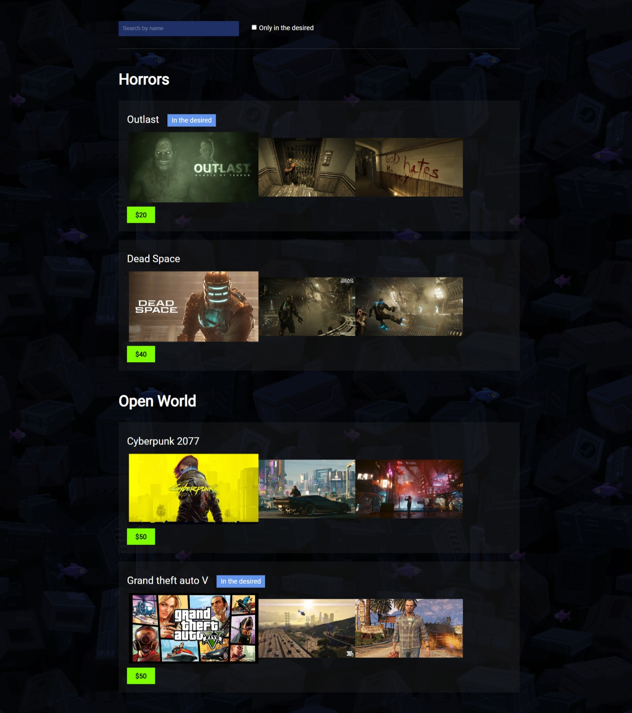

# Game List

This is a React application that displays a list of games with filtering and search functionality. Users can search for games by name and filter the list to show only games that are in their wish list.

## Features

- **Game List**: displays a list of games with their category, name, price, and images.
- **Search**: users can search for games by entering a search term in the search bar. The list will update in real-time to show only the games that match the search term.
- **Wish List Filter**: users can toggle a checkbox to filter the list and show only the games that are in their wish list.
- **Category Grouping**: the games are grouped by category, with each category displayed in a separate section.

## Technologies Used

- **React**
- **JavaScript**
- **CSS**

## Preview

